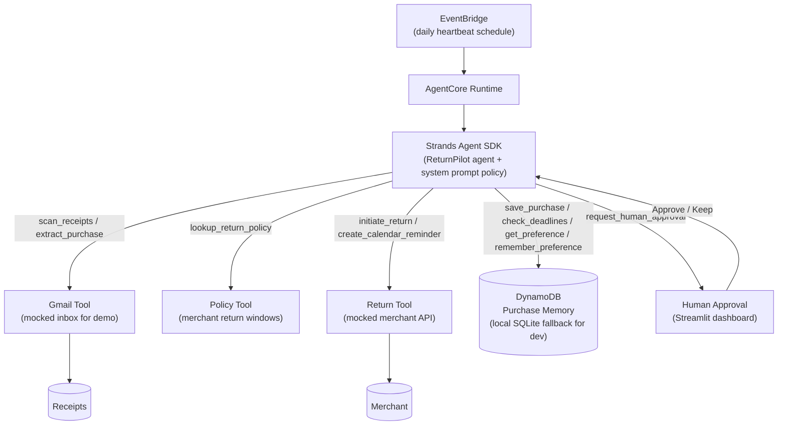

# ReturnPilot — Architecture



## How this maps to the code

| Diagram node | Code |
|---|---|
| EventBridge (daily heartbeat) | `scripts/run_heartbeat.py` — in production, an EventBridge rule invoking this on a schedule. Demo uses the dashboard's **Simulate Daily Run** button instead of a live schedule, to avoid burning setup time on IAM/cron permissions during the hackathon. |
| AgentCore Runtime | Optional deployment target for the same agent code (`src/agent.py`). Runs locally / on the dashboard for the demo; `AgentCore` is the stated production target. |
| Strands Agent SDK | `src/agent.py` — `build_agent()`, system prompt encodes the full decision policy (routine auto-return vs. human-approval gate). |
| Gmail Tool | `scan_receipts()` / `extract_purchase()` in `src/tools.py`. Reads `data/mock_inbox.json` for the demo instead of live OAuth. |
| Policy Tool | `lookup_return_policy()` in `src/tools.py`, backed by `src/return_policies.py`. |
| Return Tool | `initiate_return()` / `create_calendar_reminder()` in `src/tools.py`. Mocked merchant API — returns a generated request ID and marks state, no real merchant integration required for the demo. |
| DynamoDB / Purchase Memory | `src/memory.py` — `DynamoDBStore` (real AWS) or `LocalSQLiteStore` (default/demo), switchable via `RETURNPILOT_STORAGE` in `.env`. Stores both purchases and learned preferences (e.g. "Best Buy returns go in-store"). |
| Human Approval | `request_human_approval()` tool + the Streamlit dashboard's **Pending approval** section (`dashboard/app.py`), with Approve Return / Keep Item buttons. |

## The agent loop

```
Heartbeat wakes up (EventBridge / "Simulate Daily Run")
        |
        v
check_deadlines() across all tracked purchases
        |
        v
For each purchase, deadline approaching?
   NO  -> leave it, move on
   YES -> already marked "return" AND price < $200?
             YES -> initiate_return() + create_calendar_reminder() (auto)
             NO  -> request_human_approval(), STOP for this item
                       |
                       v
                Human clicks Approve / Keep in dashboard
                       |
             Approve -> initiate_return() + create_calendar_reminder()
                          + remember_preference() if a pattern emerges
             Keep    -> update_purchase_state("completed")
```
